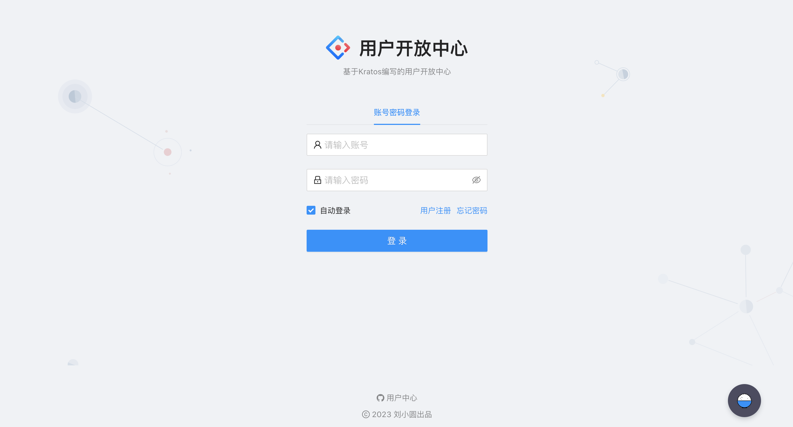

## 这是一个用户中心的简单实现 👋
### 需求分析
- 1⃣️ 登录注册 
- 2⃣️ 用户管理 (仅管理员可见) 对用户的查询或者修改
- 3⃣️ 用户校验（仅星球用户）

### 技术选型
- 前端：三件套 + React + 组件库 Ant Design + Umi + Ant Design Pro
- 后端：Golang + Kratos + Gorm + Mysql + Redis + Wire + Grpc
- 部署：服务器 / 容器（平台）

### 作品展示
#### 首页

<!--

**Here are some ideas to get you started:**

🙋‍♀️ A short introduction - what is your organization all about?
🌈 Contribution guidelines - how can the community get involved?
👩‍💻 Useful resources - where can the community find your docs? Is there anything else the community should know?
🍿 Fun facts - what does your team eat for breakfast?
🧙 Remember, you can do mighty things with the power of [Markdown](https://docs.github.com/github/writing-on-github/getting-started-with-writing-and-formatting-on-github/basic-writing-and-formatting-syntax)
-->
